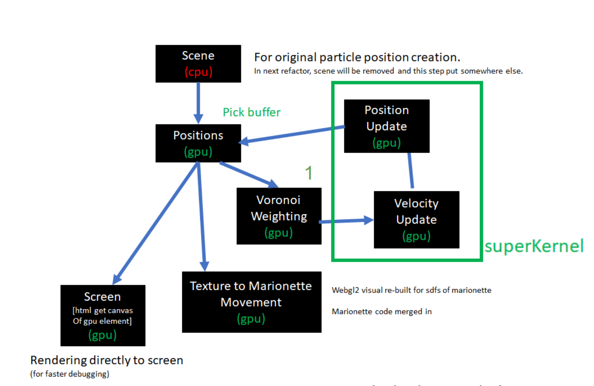
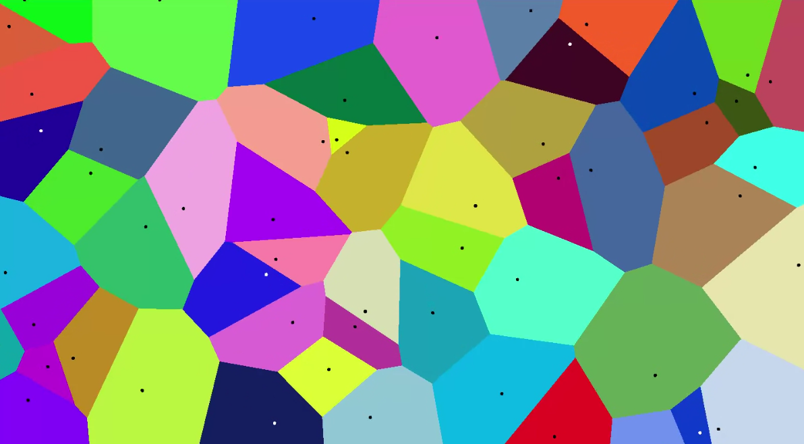
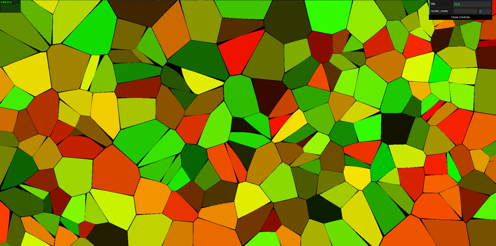

[Read Milestone 2](./Milestone2.md)
 
 
# Odin - Milestone 3
Developers:
  Hannah Bollar: [LinkedIn](https://www.linkedin.com/in/hannah-bollar/), [Website](http://hannahbollar.com/)
  Eric Chiu: [LinkedIn](https://www.linkedin.com/in/echiu1997/), [Website](http://www.erichiu.com/)

## Current Progress:

### Issues resolved from last milestone

- gpu.js
	- Fixed indexing for visual for texture passes (so have velocity update and movement) 
	- also doing a gimmicky second canvas to get an additional `2d` context so can have debug visual of texture passed through of final voronoi output - might remove this later for speed and/or might find a better way to optimize this.

### New Features implemented

- gpu.js
	- compressed `velocityUpdate` and `positionUpdate` into a `superKernel` - allowing for optimized memory passing
	- finished setting up appropriate pipeline for `velocityUpdate` so have movement through texture passes
	- shortened number of passes over voronoi from 2 to 1 s.t. it's no longer a for each pixel check all agents (x2) or all colors (x2)
		- shortened to one pass based on two closest agents for coloring white (the image depicted below has coloring with black for distinctiveness)
	- instead of doing memory buffer swap by actually copying memory over, just switching reference variables for buffer update.

#### Pipeline changes

 Issues with Previous Changes | New Pipeline Optimizations
:-------------------------:|:-------------------------:|
 | 

 By milestone 2 we had ported most of the gpu.js outputing to be through texture passes, so the output to input from one pass to another remains on the gpu. Even with this optimizations, there were still places, we could improve it further.

 To start, instead of doing a second fake shader pass to check for buffer regions between the voronoied areas, we manually calculate it based on the two closest `agents` which were already calculated in the first half of the gpujs-kernel anyways. Thus, we cut the number of these passes down from 2 to 1.

 Additionally, though we had a separate `positionUpdate` method based on the `velocityUpdate` method, we could still optimize this further by creating a `superKernel`. This means when the `gpujs` code compiles, instead of creating two separate shader setups for both without knowledge of each other, when creating the backend webgl2 shader versions of the `gpu.js` kernels - it optimizes the texture pass from one kernel to the other inside of the super kernel, allowing for an even more optimized output.

 Lastly, instead of doing an additional kernal update for moving position values from one buffer to another in the `positionsUpdate` to `positions` step, we just optimized to have two separate holder variables that just switch off which buffer they're referencing removing the large memory manipulations in this step.

`note: in the below comparisons, the first voronoi does not have the same initial setup for positions as the other`

Generic Voronoi | Voronoi with Black Buffer Areas
:-------------------------:|:-------------------------:|
| 

#### We have movement!

Additionally, we also finally have movement using the texture passes!
(currently the movement is a simple, add `(0.1, 0.1, 0.1)` to position just to make sure the pipeline is functional.

### Issues still to resolve from this Milestone

- gpu.js
	- voronoi diagram for some reason looks like the entire diagram is just redrawing in a specific direction when the positional points move on screen - could be because all moving in same direction and/or my reference alternating for position buffer updating between `renderFrame` calls is not working as I expect it to
	- also doing a gimmicky second canvas to get an additional `2d` context so can have debug visual of texture passed through of final voronoi output - might remove this later for speed and/or might find a better way to optimize this.

